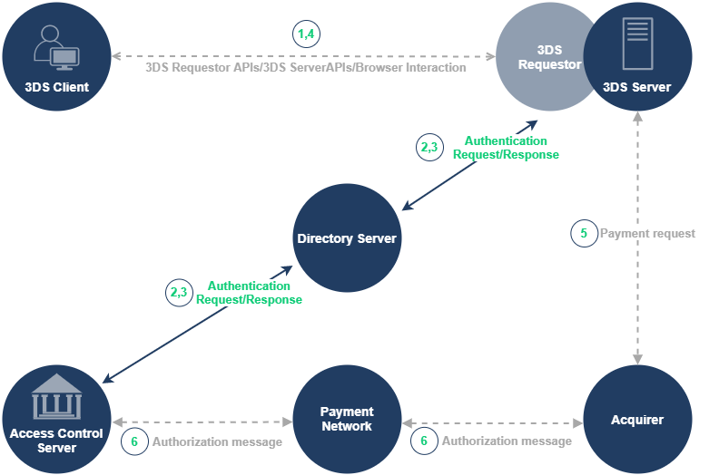

# 3DS Terminology

#### Directory Server \(DS\)

A server component operated in the Interoperability Domain; it performs a number of functions that include: 

* authenticating the 3DS Server
* routing messages between the 3DS Server and the ACS
* validating the 3DS Server, the 3DS SDK, and the 3DS Requestor.

#### Issuer

A financial institution that issues payment cards, contracts with Cardholders to provide card services, determines eligibility of Cardholders to participate in 3-D Secure, and identifies for the Directory Server card number ranges eligible to participate in 3-D Secure.

#### **Access Control Server \(ACS\)**

A component that operates in the Issuer Domain, that verifies whether authentication is available for a card number and device type, and authenticates specific Cardholders.

The ACS contains the authentication rules and is controlled by the Issuer. ACS functions include:

* Verifying whether a card number is eligible for 3-D Secure authentication
* Verifying whether a Consumer Device type is eligible for 3-D Secure authentication
* Authenticating the Cardholder or confirming account information.

#### Access Control Server User Interface \(ACS UI\)

The ACS UI is generated during a Cardholder challenge and is rendered by the ACS within a Browser challenge window.

#### Merchant

Entity that contracts with an Acquirer to accept payment cards. Manages the online shopping experience with the Cardholder, obtains card number, and then transfers control to the 3DS Server, which conducts payment authentication.

#### Attempts

In this specification, used to indicate the process by which proof of an authentication attempt is generated when payment authentication is not available. Support for Attempts is determined by each DS.

#### Frictionless

The process of authentication achieved without Cardholder interaction.

#### Challenge Flow

A 3-D Secure flow that involves Cardholder interaction

#### Authorisation

A process by which an Issuer, or a processor on the Issuer's behalf, approves a transaction for payment.

## 3DS Messages

#### Authentication Request Message \(AReq\)

The AReq message is the initial message in the 3-D Secure authentication flow. The 3DS Server forms the AReq message when requesting authentication of the Cardholder. It can contain Cardholder, payment, and Device information for the transaction. There is only one AReq message per authentication.

#### Authentication Response Message \(ARes\)

The ARes message is the Issuer’s ACS response to the AReq message. It can indicate that the Cardholder has been authenticated, or that further Cardholder interaction is required to complete the authentication. There is only one ARes message per transaction.

#### Challenge Request Message \(CReq\)

An EMV 3-D Secure message sent by the 3DS SDK or 3DS Server where additional information is sent from the Cardholder to the ACS to support the authentication process and to carry the authentication data from the Cardholder.

#### **Challenge Response Message \(CRes\)**

The ACS response to the CReq message. It can indicate the result of the Cardholder authentication or, in the case of an App-based model, also signal that further Cardholder interaction is required to complete the authentication.

#### Results Request Message \(RReq\)

The RReq message communicates the results of the authentication or verification. The message is sent by the ACS through the DS to the 3DS Server. There is only one RReq message per AReq message. The RReq message is not present in a Frictionless transaction.

#### Results Response Message \(RRes\)

Message sent by the 3DS Server to the ACS via the DS to acknowledge receipt of the Results Request message. This message is not part of the 3-D Secure authentication message flow.

## Authentication Flows

#### Frictionless Flow

The Frictionless Flow initiates a 3-D Secure authentication flow and consists of an AReq message and an ARes message. The Frictionless Flow does not require further Cardholder interaction to achieve a successful authentication and complete the 3-D Secure authentication process. Frictionless flow allows the issuer to approve a transaction without cardholder interaction based on risk-based-authentication performed in the ACS. 

The frictionless flow comprises these following steps:

The cardholder initiates a transaction and provides the necessary information for the authentication.

1. Within the 3DS Requestor Environment, the necessary 3-D Secure information is gathered and provided to the 3DS Server for inclusion in the AReq message.
2. **3DS Server through DS to ACS**—Using the information provided by the Cardholder and data gathered within the 3DS Requestor Environment, the 3DS Server creates and sends an AReq message to the DS, which then forwards the message to the appropriate ACS.
3. **ACS through DS to 3DS Server**—In response to the AReq message, the ACS returns an ARes message to the DS, which then forwards the message to the initiating 3DS Server. Before returning the response, the ACS evaluates the data provided in the AReq message. In a Frictionless Flow, the ACS determines that further Cardholder interaction is not required to complete the authentication.
4. **3DS Requestor Environment**—The 3DS Server communicates the result of the ARes message to the 3DS Requestor Environment which then informs the Cardholder.

#### Challenge Flow

If the ACS determines that further Cardholder interaction is required to complete the authentication, the Frictionless Flow transitions into the Challenge Flow. For example, a challenge may be necessary because the transaction is deemed high-risk, is above certain thresholds, or requires a higher level of authentication due to country mandates \(or regulations\). 3DS Requestors decide whether to proceed with the challenge, or to terminate the 3-D Secure authentication process.

The challenge flow comprises the following steps:

The cardholder initiates a transaction and provides the information necessary for the authentication.

1. Within the 3DS Requestor Environment, the necessary 3-D Secure information is gathered and provided to the 3DS Server for inclusion in the AReq message.
2. **3DS Server through DS to ACS**—Using the information provided by the Cardholder and data gathered within the 3DS Requestor Environment, the 3DS Server creates and sends an AReq message to the DS, which then forwards the message to the appropriate ACS.
3. **ACS through DS to 3DS Server**—In response to the AReq message, the ACS returns an ARes message to the DS, which then forwards the message to the initiating 3DS Server. Before returning the response, the ACS evaluates the data provided in the AReq message. The ARes message indicates that further Cardholder interaction is required to complete the authentication.
4. **3DS Requestor Environment**—The 3DS Server communicates the result of the ARes message to the 3DS Requestor Environment; further Cardholder interaction is required to complete the authentication.
5. **3DS Client to ACS**—The 3DS Client initiates a CReq message based on information received in the ARes message. CReq message is formed by the 3DS Server and is posted through the Cardholder’s browser by the 3DS Requestor to the ACS URL received from the ARes message.
6. **ACS to 3DS Client -** The ACS receives the CReq message and interfaces with the 3DS Client to facilitate Cardholder interaction. The ACS sends the authentication user interface to the Cardholder browser. The Cardholder enters the authentication data via the browser to be checked by the ACS. In response to the CReq message, the CRes message is formed by the ACS and sent to the 3DS Server to indicate the result of the authentication.
7. **ACS through DS to 3DS Server**—The ACS sends an RReq message that can include the Authentication Value \(AV\) to the DS, which then routes the message to the appropriate 3DS Server using the 3DS Server URL received from the AReq message.
8. **3DS Server through DS to ACS**—The 3DS Server receives an RReq message and in response, returns an RRes message to the DS, which then routes the message to the ACS.

## 3DS Data Elements

#### acquirerBIN - Acquirer BIN

Acquiring institution identification code as assigned by the DS receiving the AReq message. 

* Length: Variable, maximum 11 characters
* Data type: string

#### acquirerMerchantID - Acquirer Merchant ID

Acquirer-assigned Merchant identifier. This may be the same value that is used in authorisation requests sent on behalf of the 3DS Requestor and is represented in ISO 8583 formatting requirements. 

* Length: Variable, maximum 35 characters
* Data type: string

#### mcc - Merchant Category Code

DS-specific code describing the Merchant’s type of business, product or service.

* Length: 4 characters 
* Data Type: String 
* This value correlates to the Merchant Category Code as defined by each Payment System or DS.

#### merchantName - Merchant Name

Merchant name assigned by the Acquirer or Payment System.

* Length: Variable, maximum 40 characters 
* Data Type: String

#### authenticationValue - Authentication Value

Payment System-specific value provided by the ACS or the DS using an algorithm defined by Payment System. Authentication Value may be used to provide proof of authentication.

* Length: 28 characters 
* Data type: String 
* Value accepted: A 20-byte value that has been Base64 encoded, giving a 28-byte result.

#### dsTransID - DS Transaction ID

Universally unique transaction identifier assigned by the DS to identify a single transaction.

* Length: 36 characters 
* Data type: String 
* Value accepted: Canonical format as defined in IETF RFC 4122. May utilise any of the specified versions as long as the output meets specified requirements.

#### messageVersion - Message Version Number

Protocol version identifier This shall be the Protocol Version Number of the specification utilised by the system creating this message. The Message Version Number is set by the 3DS Server which originates the protocol with the AReq message. The Message Version Number does not change during a 3DS transaction.

* Length: Variable, 5–8 characters 
* Data type: String

#### transStatus - Transaction Status

Indicates whether a transaction qualifies as an authenticated transaction or account verification. Note: The Final CRes message can contain only a value of Y or N. Note: If the 3DS Requestor Challenge Indicator = 06 \(No challenge requested; Data share only\), then a Transaction Status of C is not valid.

* Length: 1 character 
* Data type: String 

Possible values:

* Y = Authentication Verification Successful. 
* N = Not Authenticated/Account Not Verified; Transaction denied. 
* U = Authentication/Account Verification Could Not Be Performed; Technical or other problem, as indicated in ARes or RReq. 
* A = Attempts Processing Performed; Not Authenticated/Verified, but a proof of attempted authentication/verification is provided. 
* C = Challenge Required; Additional authentication is required using the CReq/CRes. 
* R = Authentication/Account Verification Rejected; Issuer is rejecting authentication/verification and request that authorisation not be attempted.

#### threeDSServerTransID - 3DS Server Transaction ID

Universally unique transaction identifier assigned by the 3DS Server to identify a single transaction.

* Length: 36 characters 
* Data type: String 
* Value accepted: Canonical format as defined in IETF RFC 4122.

#### cardholderInfo - Cardholder Information Text

Text provided by the ACS/Issuer to Cardholder during a Frictionless or Decoupled transaction. The Issuer can provide information to Cardholder. For example, “Additional authentication is needed for this transaction, please contact \(Issuer Name\) at xxx-xxx-xxxx.”

* Length: Variable, maximum 128 characters 
* Data Type: String 
* Note: If field is populated this information is required to be conveyed to the cardholder by the merchant.

#### transStatusReason - Transaction Status Reason

Provides information on why the Transaction Status field has the specified value.

* Length: 2 characters
* Data Type: String
* Values accepted:
  * 01 = Card authentication failed 
  * 02 = Unknown Device 
  * 03 = Unsupported Device 
  * 04 = Exceeds authentication frequency limit 
  * 05 = Expired card 
  * 06 = Invalid card number 
  * 07 = Invalid transaction 
  * 08 = No Card record 
  * 09 = Security failure 
  * 10 = Stolen card 
  * 11 = Suspected fraud 
  * 12 = Transaction not permitted to cardholder 
  * 13 = Cardholder not enrolled in service 
  * 14 = Transaction timed out at the ACS 
  * 15 = Low confidence 
  * 16 = Medium confidence 
  * 17 = High confidence 
  * 18 = Very High confidence 
  * 19 = Exceeds ACS maximum challenges 
  * 20 = Non-Payment transaction not supported 
  * 21 = 3RI transaction not supported 
  * 22 = ACS technical issue 
  * 23 = Decoupled Authentication required by ACS but not requested by 3DS Requestor 
  * 24 = 3DS Requestor Decoupled Max Expiry Time exceeded 
  * 25 = Decoupled Authentication was provided insufficient time to authenticate cardholder. ACS will not make attempt 
  * 26 = Authentication attempted but not performed by the cardholder 
  * 27–79 = Reserved for EMVCo future use \(values invalid until defined by EMVCo\) 
  * 80–99 = Reserved for DS use 

#### eci- Electronic Commerce Indicator

The Electronic Commerce Indicator is a Payment System-specific value provided by the ACS or DS to indicate the results of the attempt to authenticate the Cardholder.

* Length: 2 characters 
* Data Type: String


Source: The official EMVCo 3D specification 2.2.0 [https://www.emvco.com/emv-technologies/3d-secure/](https://www.emvco.com/emv-technologies/3d-secure/)


