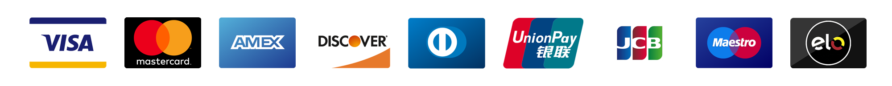

# Getting Started

## Overview

Before we get started, take a minute and let us introduce you to the magic of [**PCI Proxy**](https://www.pci-proxy.com).


PCI Proxy is a tokenization service that reduces your PCI scope in a simple and secure way.


PCI Proxy let you **instantly collect and store credit card data **without touching your servers. Once stored and tokenized, you can simply **use tokens to validate, charge, display, or forward** stored card data.

* [**Explore PCI Proxy Features**](https://www.pci-proxy.com/pci-proxy/features/)

Our **customer base** spans across different industries and business types. All of them have specific needs and processes in place. PCI Proxy is build with flexibility in mind to accommodate those needs at best.

PCI Proxy is a battle-tested tokenization as a service solution that is powered by [Datatrans AG](https://www.datatrans.ch/), the leading Swiss Payment Service Provider.

PCI Proxy supports all major credit card brands:

## Getting Started

[**Sign up**](https://www.pci-proxy.com/pci-proxy/contact/) for a free 30-day trial account \(no billing information required\).

PCI Proxy can be integrated by following these steps to achieve PCI compliance:








**Questions?**

Don't hesitate to talk to us via email, phone, or Slack. We love to help you with the integration or other questions around PCI compliance or the PCI Proxy.

Phone: +41 44 256 81 91  
Email: [support@pci-proxy.com](mailto:support@pci-proxy.com)


