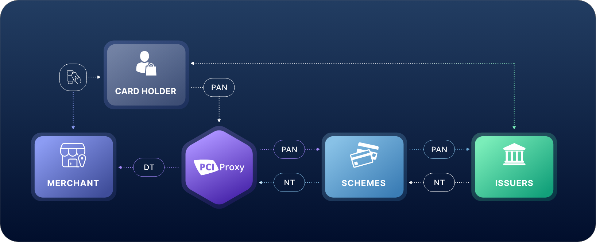

# Network Token provisioning

Token provisioning is the process of requesting a Network Token from the affected card brand for a specific PAN and for a specific purpose, domain or device. The graph below shows how the Network Token provisioning process with PCI Proxy and the other involved parties is working.&#x20;

<figure><figcaption>
PAN = Credit card number  /  NT = Network Token  /  DT = Datatrans Token
</figcaption></figure>

1. Cardholder enters card details
2. PCI Proxy requests Network Token at the card schemes
3. Card schemes reach out to the card issuing bank of the cardholder&#x20;
4. Card issuing bank creates Network Token and returns it via the card schemes to PCI Proxy
5. PCI Proxy maps the Network Token to the PCI Proxy token which is returned to the merchant

When the scheme onboarding is completed and your account is activated for Network Tokens, we automatically request a new Network Token each time a credit card gets captured and tokenized via the PCI Proxy APIs. As of today, using one of the following integration methods supports Network Token provisioning:&#x20;

* [SecureFields](../../collect/secure-fields-js/)
* [Mobile SDKs](../../collect/mobile-sdks.md)
* [3D SecureFields](../../authenticate/3d-secure-fields-js/)
* [Filter Proxy](../../collect/filter-proxy/) (under development - coming soon)
* Standalone API (under development - coming soon)

As soon as a credit card number hits one of the above mentioned APIs we create a Network Token and the corresponding Cryptogram in the background. We map the Network Token and the meta data (cryptogram, expiry date and eci value) to the PCI Proxy token which is returned to your servers.&#x20;


To check whether a Network Token has been provisioned or not, please use use the [Tokenization API](../../collect/secure-fields-js/#4.-obtain-the-tokens) (if you have a transactionID) or the [Alias Status API](account-lifecycle-management.md#alias-status-api) (if you have a PCI Proxy alias) and look for the `tokenInfo` object in the response. When available, a Network Token has been mapped to the PCI Proxy token.&#x20;


Mapping the Network Token to the PCI Proxy token allows you to continue with all the existing PCI Proxy processes without changing your code whilst not extending your PCI scope.&#x20;


We do not return the Network Token nor the Cryptogram. They are being considered as sensitive payment information according PCI DSS and would extend your PCI scope significantly when storing or processing them together in your environment.&#x20;


Although the final goal of Network Tokenization is to remove plain text card numbers completely, PCI Proxy will still store the underlying PAN behind the PCI Proxy token for a certain transition period. This allows us to provide a fallback solution when Network Tokens can't be used as not all parties in the payment eco system are already accepting them. By keeping the PAN on our secure servers, we allow merchants to continue forwarding PANs to third party receivers who are not yet able to consume Network Tokens or if the Issuing bank is not yet supporting Network Tokens.&#x20;

There are regulations and requirements in certain countries and markets which prohibit the storage of any PAN - even on PCI DSS level 1 certified systems. Please let us know if you wish to not store the underlying PAN for your account anymore.&#x20;

### Good to know

* The creation of a Network Token does not require a CVC (card verification code)
* Network Tokens do not replace 3D Secure strong customer authentication. If your business is required to perform a second factor authentication, please use our [3D Secure authentication](../../authenticate/3d-secure-api.md) service.&#x20;
