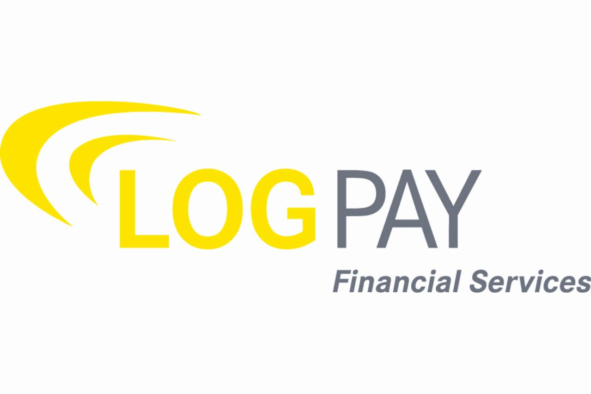

# Supported Acquirers

## Credit and Debit Card Acquirers

<table><thead><tr><th width="150"> </th><th>Acquirer</th><th>Payment Method</th></tr></thead><tbody><tr><td>         </td><td>American Express International</td><td><code>American Express</code></td></tr><tr><td> </td><td>Card Complete</td><td><code>Mastercard</code>, <code>Visa</code>, <code>JCB</code>, <code>Maestro</code></td></tr><tr><td> </td><td>Chase Paymentech</td><td><code>Mastercard</code>, <code>Visa</code></td></tr><tr><td></td><td>Clearhaus</td><td><code>Mastercard</code>, <code>Visa</code></td></tr><tr><td> </td><td>Concardis</td><td><code>Mastercard</code>, <code>Visa</code>, <code>Union Pay</code>, <code>Maestro</code></td></tr><tr><td> </td><td>Dankort</td><td><code>Dankort</code></td></tr><tr><td> </td><td>Elavon</td><td><code>Mastercard</code>, <code>Visa</code>, <code>Diners</code>,  <code>Discover</code>, <code>Maestro</code></td></tr><tr><td> </td><td>European Merchant Services</td><td><code>Mastercard</code>, <code>Visa</code>, <code>Maestro</code></td></tr><tr><td> </td><td>EVO Payments</td><td><code>Mastercard</code>, <code>Visa</code></td></tr><tr><td> </td><td>Fiserv</td><td><code>Mastercard</code>, <code>Visa</code></td></tr><tr><td> </td><td>Hobex</td><td><code>Mastercard</code>, <code>Visa</code></td></tr><tr><td> </td><td>Ingenico</td><td><code>Mastercard</code>, <code>Visa</code>, <code>Diners</code>,  <code>Discover</code>, <code>Maestro</code></td></tr><tr><td> </td><td>Logpay</td><td><code>Mastercard</code>, <code>Visa</code>, <code>American Express</code>,  <code>Diners</code>, <code>JCB</code></td></tr><tr><td> </td><td>Llyods Bank Cardnet</td><td><code>Mastercard</code>, <code>Visa</code></td></tr><tr><td> </td><td>Nets</td><td><code>Mastercard</code>, <code>Visa</code></td></tr><tr><td> </td><td>Payone</td><td><code>Mastercard</code>, <code>Visa</code>, <code>JCB</code>, <code>Maestro</code></td></tr><tr><td></td><td>Planet Payment</td><td><code>Mastercard</code>, <code>Visa</code></td></tr><tr><td> </td><td> SIX Payments Services</td><td><code>Mastercard</code>, <code>Visa</code>, <code>American Express</code>,  <code>Diners</code>,  <code>Discover</code>, <code>UnionPay</code>, <code>Maestro</code></td></tr><tr><td> </td><td>Société Générale</td><td><code>Mastercard</code>, <code>Visa</code>, <code>Maestro</code></td></tr><tr><td> </td><td>Swisscard AECS</td><td><code>American Express</code></td></tr><tr><td> </td><td>UATP</td><td><code>Airplus</code></td></tr><tr><td> </td><td>Worldpay</td><td><code>Mastercard</code>, <code>Visa</code></td></tr></tbody></table>


Do you miss an acquirer? Please [contact](../../help/contact.md) us.&#x20;



Check here all the payment methods supported by Datatrans [https://www.datatrans.ch/en/features/payment-methods/](https://www.datatrans.ch/en/features/payment-methods/)


