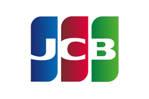
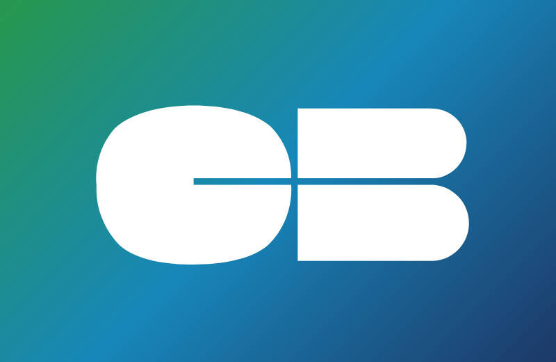

# Overview

Protect yourself against fraudulent transactions using our unique vendor-independent <mark style="color:blue;">**3D Secure Authentication-Only**</mark> approach. Perform only the 3D Secure authentication with PCI Proxy and share 3DS authentication data with partners and payment gateways for payment authorization at a later stage.

PCI Proxy complies with the latest 3D Secure 2 standard from [EMVCo](https://www.linkedin.com/company/emvco/):

<table><thead><tr><th width="292.4400248601616">Brand</th><th width="150">Code</th><th>Version</th></tr></thead><tbody><tr><td>Mastercard</td><td><code>ECA</code></td><td>3-D Secure 2.2</td></tr><tr><td>Visa</td><td><code>VIS</code></td><td>3-D Secure 2.2</td></tr><tr><td> American Express</td><td><code>AMX</code></td><td>3-D Secure 2.2</td></tr><tr><td>Diners Club</td><td><code>DIN</code></td><td>3-D Secure 2.1</td></tr><tr><td>Discover</td><td><code>DIS</code></td><td>3-D Secure 2.1</td></tr><tr><td> Union Pay</td><td><code>CUP</code></td><td>3-D Secure 2.2</td></tr><tr><td>  Maestro</td><td><code>MAU</code></td><td>3-D Secure 2.2</td></tr><tr><td>Dankort</td><td><code>DNK</code></td><td>3-D Secure 2.1</td></tr><tr><td> JCB</td><td><code>JCB</code></td><td>3-D Secure 2.2</td></tr><tr><td> Cartes Bancaires</td><td><code>CBL</code></td><td>3-D Secure 2.2</td></tr></tbody></table>

## Integration

Learn about PCI Proxy's integration choices for authenticating transactions:


[3d-secure-fields-js](3d-secure-fields-js/)



[3d-secure-mobile-sdks.md](3d-secure-mobile-sdks.md)



[3d-secure-api.md](3d-secure-api.md)


## Dynamic 3D Secure

Our product <mark style="color:blue;">**Dynamic 3D Secure**</mark> takes care of applying 3D Secure authentication only if your client's card issuer is from an EEA country. Based on the card number, we are able to identify if this is the case or not. While this product may reduce friction during checkouts, especially for countries where 3D Secure is not as dominant as it is in EEA countries, the liability shift protection will be completely missing for such transactions. We do recommend to enforce 3D Secure whenever possible. To activate Dynamic 3D Secure, please get in touch with your account manager at Datatrans or send us a [message](../help/contact.md).

## New to 3D Secure?&#x20;

Simply [drop us a message](../help/contact.md) if you're interested in taking advantage of <mark style="color:blue;">**Authentication-Only**</mark> and our experts will reach out and find the best way how to proceed together with you. Please also check the following terminology page for&#x20;
