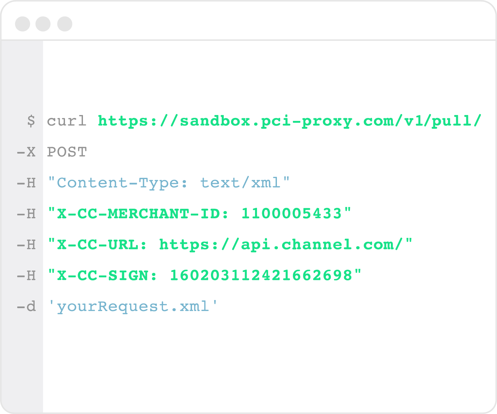

# Collect & store cards

In general, you have different inbound channels where you receive sensitive card data from customers or partners. In order to avoid sensitive card data touching your systems, choose your source of credit card data and implement the respective PCI Proxy API.

## Choose source of card data and integrate PCI Proxy API


**With all described methods, sensitive card data never touch your servers**.


| [**Website**](capture-iframes/) \(IBE\) | [**Remote Server**](filter-payloads.md) \(Webservice\) | [**Native App**](vault-alias-gateway.md) \(iOS / Android\) |
| :--- | :--- | :--- |
|  |  |  |
| Your customers enter their credit card data on a form within your website. | You receive a request from a remote server including credit card data in the payload. | Your customers enter their credit card data on a form within your native app. |
| [Inline Mode](capture-iframes/) seamlessly tokenizes sensitive data within your web app. | [Filter Proxy](filter-payloads.md) tokenizes sensitive data on the fly within your web services. | [Vault \(alias gateway\)](vault-alias-gateway.md) tokenizes sensitive data within your mobile app. |

