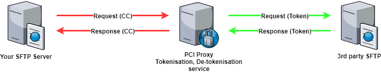

# Secure File Transfer \(SFTP\)

PCI Proxy allows you to securely transmit files containing sensitive cardholder data between Customer, Datatrans and third party server. Business could for example run some batch processes for reconciliation, payment or card update use-cases with non-compliant third party provider. 

## Process flow

## Setup

To setup a new SFTP connection please follow the below mentioned guide.

1. Tell us about the file type and data format by sending an example file
2. Determine process flow \(are you sending the file or does PCI Proxy grab the file\)
3. Exchange of IP address and TCP port
4. Exchange of SSH-Key and username
5. Determine directories where the files can be down- and uploaded to


Businesses who are sending sensitive cardholder data in plain text must be compliant according PCI DSS. 


 

