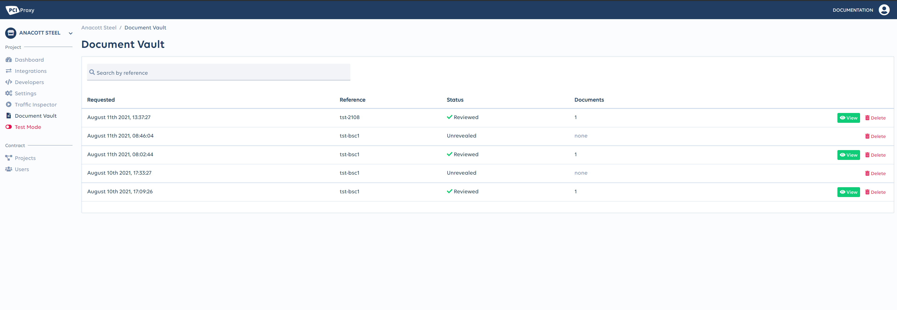

# Document Vault \(beta\)

The "Document Vault" allows your customers to upload sensitive images and documents in a PCI DSS and data security compliant environment.   
Therefore, you generate a unique upload link. The link can be presented to the user in your application. It redirects the user to an upload page which is hosted on our servers. Subsequently, the uploaded files can be reviewed in our Dashboard without the need to take care of PCI DSS compliance. 

To get started, please follow the step-by-step guide below.

## 1. Request upload link



Init call



Call our Init API from **your server** to request a unique upload link. 






Your PCI Proxy API Key



application/json; charset=UTF-8





Unique reference number each request



The URL where the cardholder gets redirected to if the upload was successful



The URL where the cardholder gets redirected to if the upload process got cancelled 



There URL where the cardholder gets redirected to if the upload process failed







Success response


```javascript
{
    "link": "https://dev-dashboard-pciproxy.datatrans.biz/public/vault/BF33A0C8-F9ED-44AD-B818-015C08D76A44"
}
```





### Request & Response example



```javascript
curl -L -X POST 'https://dashboard.pci-proxy.com/api/vault/request' \
-H 'pci-proxy-api-key: {{API Key}}' \
-H 'content-type: application/json' \
--data-raw '{
    "reference":"tst-210812",
    "successUrl":"https://example.org/success",
    "cancelUrl":"https://example.org/cancel",
    "errorUrl":"https://example.org/error"
}'
```



```javascript
{
    "link": "https://dev-dashboard-pciproxy.datatrans.biz/public/vault/BF33A0C8-F9ED-44AD-B818-015C08D76A44"
}
```



## 2. Redirect the cardholder 

Embed the upload link received from the response into your application and redirect the cardholder to it.   
  
In case of a successful, cancelled or failed upload the cardholder will be redirected automatically to the URLs specified in the API request above. 


Supported file-types: `image/png`, `image/jpeg`, `image/heic`, `application/pdf`


## 3. Review uploaded documents

Login to our [dashboard](https://dashboard.pci-proxy.com/login) and navigate to the "Document Vault" menu within the Project section on the left-hand side menu bar. Press the View button to reveal an uploaded document. 


The "Document Vault" menu requires special user rights with mandatory 2FA enabled.   
Please contact us to assign such a user role. 




