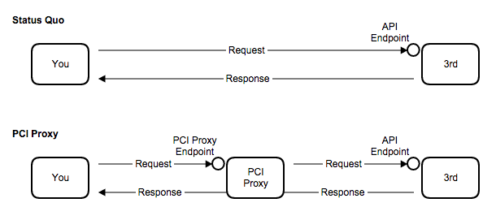

# Forward payment data to 3rd party

Let us assume you send requests with sensitive payment data via API to a 3rd party.

PCI Proxy allows you to forward vaulted payment data to PCI compliant third parties (e.g. online travel agency, payment processor, hotel, airline, car rental, etc.). 

`By switching PCI Proxy between you and the 3rd party`, you invoke requests having PCI Proxy as endpoint. In your request, you simply use the token that you received when you collected the payment data. PCI Proxy replaces the token with payment data and forwards the record to the 3rd party. Any responses from the 3rd party are passed back to you. 

## How to start

Forwarding payment data is like extracing payment data. Therefore, you can use the same API.


## Perform a pull request against a 3rd party

**Understanding the process flow:**



**Consider a business that needs this ability:**

*You are a travel technology company and process reservations on behalf on your clients against global distribution systems or an online travel agency (e.g. Expedia).*

#### Quick Start Guide:

1. Add a 3rd party to your account
2. Add required HTTP header to your request.
3. POST your XML/SOAP request having PCI Proxy as endpoint.


| Test PCI Proxy PULL Endpoint: |
| -- |
| https://pilot.datatrans.biz/upp/proxy/pull/|

- Required HTTP header:


| HTTP Header      | Description                                                        | Example value
| -------------- | -------------------------------------------------------------------| ---
| `X-CC-URL` | Specifies the target (3rd party) URL that will be called | https://api.thirdparty.com/
| `X-CC-MERCHANT-ID` | Your merchant ID | 1000011011
| `X-CC-SIGN` | Configured security sign | 130709090849785405
            


```java
    $ curl "https://pilot.datatrans.biz/upp/proxy/pull" 
        -X POST 
        -H "Content-Type: text/xml" 
        -H "X-CC-MERCHANT-ID: 1100005433" 
        -H "X-CC-URL: https://api.thirdparty.com/" 
        -H "X-CC-SIGN: 160203112421662698" 
        -d 'yourRequest.xml'
```

> Note: In test mode, only test credit cards are allowed. For testing purposes, you will need our [test credit cards](https://www.datatrans.ch/showcase/test-cc-numbers). Learn more about [live mode and testing](live_mode-test.html).

## Add a 3rd party

Adding a new 3rd party is easy. Please send the following information to [thirdparty@pci-proxy.com](mailto:thirdparty@pci-proxy.com). You will receive a confirmation as soon as the 3rd party is added.

|Information| Description   |
|---|---|
|API endpoint|The URL where we should forward the request to.|
|Sample Request & Response|Please include API name, required headers, auth fields, and request method.|
| Merchant ID | Sign up to receive your merchant ID.| 
| Name & URL | Company name and website of third party |
| AOC document| Attestation of Compliance of third party to proof PCI compliance |


### Supported 3rd parties

We support a variety of 3rd party APIs out of the box. Every day, more and more get added.

### VPN and Leased Lines

In case you send data over VPN or Leased Line to a 3rd party, we can add secure connections to adapt to your needs. Please [get in touch](start@pci-proxy.com) for more info.