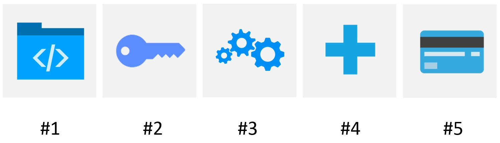

# Quick Start Guide

Get ready to start collecting cardholder data and more. 

The following sections describe how to use the PCI Proxy Sandbox in a few easy steps: 
                  
 

---

## 1. Create A Sandbox Account

To create a new test account in the Sandbox: 

1.	**Sign up** for a free test account at http://www.pci-proxy.com/#/signup

2.	Once submitted, you will receive your Sandbox login data.

3.	**Log in** to the Sandbox https://pilot.datatrans.biz/.

4.	Navigate to user administration and **create a new password**. 

---

## 2. Generate a Security Sign: 

Once you logged in and set your password, you have to generate a security sign:

1.	Navigate to UPP Administration

2.	Go to Security 

3.	Choose between Static Sign 1 (X-CC-SIGN) and Dynamic Sign 2 (SHA HASH) 

4.	Generate new sign or salt 

5.	Click on Update 

---

## 3. Choose your API: 

Choose the way you would like to collect cardholder data:

| **[Web Service](webservice.html)** | **[Web Interface](website-application.html)** | **[Native Mobile App](mobile-app.html)** | E-Mail |
| -- | -- | -- | -- |
| XML / SOAP / JSON / etc. | Website / Application | iOS / Android | E-Mail|
| e.g. Booking.com / Expedia / Stripe | e.g. Checkout / IBE / Callcenter | e.g. Checkout / IBE in mobile app | e.g. Redirect to Web Interface | 

---

## 4. Add a Channel or Receiver to your Sandbox (if applicable)

Before you can collect or extract cardholder data, you will need to send us the following information to setup@pci-proxy.com: 

  1.	Channel Type (Define if it is a push or pull channel)

  2.	API Endpoint (The URL where we should forward the request to)

  3.	Sample Request & Response (Please Include API name, required heards, auth fields and request method)

  4.	Attestation of Compliance (only for Forwards)

---

## 6. Start collect or extract payment information

Once the channel or receiver is added to your Sandbox, you can start to collect or forward cardholder data by performing a pull or push request. 

  1.	Perform a pull request against a channel: https://docs.pci-proxy.com/webservice.html 
  
  2.	Receive a push request from a channel: https://docs.pci-proxy.com/webservice.html
  
  3.	Perform a pull reques against a receiver (3rd Party): https://docs.pci-proxy.com/forward.html

...

