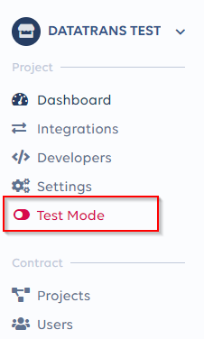

# Get production ready / Go-live


Activating your account for production starts the billing process. 


Please follow below steps to to activate your account for production.  
  
1\) Press the **Environment** switcher in the left hand side menu bar  

  
2\) Select your subscription plan, complete all required data and press submit   
3\) Choose your prefered payment method and finally enable your account for production  
4\) A confirmation email with the contract overview will be sent to the admin contact


It might be possible that we will contact you and request for more information and verification data after going live. 


