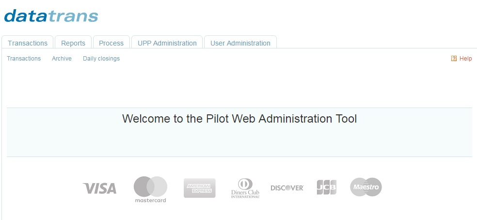

#  Sandbox (Test) Environment

Before taking your integration live, use our Sandbox environment to test it thoroughly. The Sandbox environment is a self-contained testing environment, identical to our productive environment. 

---

##Create a Sandbox Account

Follow these steps to create a Sandbox account: 

1.	[**Sign up**](http://www.pci-proxy.com/#/signup) for a free test account

2.	Once submitted, you will receive your Sandbox login data

3.	[**Log in**](https://pilot.datatrans.biz/) to the web administration tool

4.	Navigate to user administration and [**create a new password**](https://pilot.datatrans.biz/MenuDispatch.jsp?main=3&sub=2). 

 ---

 
## Sandbox Credentials
Once you are signed up, you will receive the following test credentials for your sandbox account:

| Credential | Description |
| -- | -- |
| Sandbox Merchant ID | Mandatory Parameter which identifies your sandbox environment at PCI Proxy. |
| Login Data | Username & Password to login to our [web administration tool](https://pilot.datatrans.biz/)  |
| X-CC-Sign | You will need to sign your webservice calls when you collect or forward payment data. |

---

## Sandbox Endpoints

|Pull Endpoint | Push Endpoint |
|---|---|
|https://sandbox.pci-proxy.com/v1/pull|https://sandbox.pci-proxy.com/v1/push|

 ---

## Web Administration Tool
URL: https://pilot.datatrans.biz/

Our web admin tool gives you a comprehensive management tool (backoffice) for initiating charges and credits, analysing of transactions, personalization of the web application interface, creation of reports and management of configuration data.

 ---

## Security Signs

For every request you make against our PCI Proxy, we ask for your security sign. It is a digital signature that tells us that it is really you and secures the data transmission. We differentiate between the following two:

|Statig Sign1 (X-CC-SIGN)| Dynamic Sign2 (SHA HASH)   |
|---|---|
|Our [Webservice (XML/SOAP) Proxy](https://docs.pci-proxy.com/webservice.html), the [Forward Proxy](https://docs.pci-proxy.com/forward.html) and our [Charge API](https://docs.pci-proxy.com/charge.html) need a static sign. You send it as X-CC-SIGN in the http header with every webservice call (collect or forward). When you sign up for the developer test account, we set the  *X-CC-SIGN* for you. You can change it any time in our [web admin tool](http://pilot.datatrans.biz) under *“UPP Administration” / “Security”*|Our [Website/Application interface](https://docs.pci-proxy.com/website-application.html) and our [Show interface](https://docs.pci-proxy.com/show.html) need a dynamic digital signature. You can generate the sign with a standard HMAC-SHA-256 hash procedure and using a merchant-specific encryption key. The HMAC key is generated by the system and can be changed at any time in our [web admin tool](http://pilot.datatrans.biz) under *“UPP Administration” / “Security” / “Other Services”.* The key is delivered in hexadecimal format, and it should also be stored in this format. Before its usage the key must be translated into byte format.|
| Click on [web service example](https://docs.pci-proxy.com/webservice.html)|Click on [show example](https://docs.pci-proxy.com/show.html)|

### How to create a HMAC-SHA-256 Hash

You can generate the dynamic sign2 as follows: `SHA.256(salt+merchantId+aliasCC)`

Translate HMAC key from hex to byte format. Create string to be signed by concatenating of parameters in the following order and without separators:

+ salt `V3hmMm29gD35OVHWDSAYKBIBCRg0znRekNvGbM9d8I4GRgfIcs`+
+ merchantId `1100005007 `+
+ aliasCC `424242SKMPRI4242`

- ** = SHA256 Hash** `428dd59d048d78144a0def92a27b934f7bb39138161baf482ae2deb95c1741f5`

---

 
 ## Test Data

We have a set of test credit card numbers that you can use in our sandbox environment to test your integration. 

| Card type | Card number | Expiration Date | CVV  | Test rule | Support 3D |
| -- | -- | -- | -- | -- | -- | -- |
| Visa | 4242424242424242 | 12/2018 or 06/2018 | 123  | w/limit | No |
| Visa | 4900000000000086 | 12/2018 or 06/2018 | 123  | wo/limit | Yes |
| Visa | 4900000000000003 | 12/2018 or 06/2018 | 123  | w/limit | Yes |
| MasterCard | 5404000000000001 | 12/2018 or 06/2018 | 123 | w/limit | Yes |
| MasterCard | 5200000000000007 | 12/2018 or 06/2018 | 123 | w/limit | No |
| MasterCard | 5200000000000080 | 12/2018 or 06/2018 | 123 | wo/limit | Yes |
| Amex | 375811111111115 | 12/2018 or 06/2018 | 1234 | w/limit | No |
| Amex | 375000000000007 | 12/2018 or 06/2018 | 1234 | wo/limit | Yes |
| Amex | 375811111111123 | 12/2018 or 06/2018 | 1234 | wo/limit | No |
| Diners | 36168002586009 | 12/2018 or 06/2018 | 123 | w/limit | - |
| Diners | 36167719110012 | 12/2018 or 06/2018 | 123 | wo/limit | - |
| JCB | 3569990010030442 | 12/2018 or 06/2018 | 123 | w/limit | - |
| JCB | 3569990010030400 | 12/2018 or 06/2018 | 123 | wo/limit | - |

Please note: Ordinary credit card information cannot be used in the sandbox. 

 ---

## Slack Developer Chat

Chat with our developers if you need support relating to your sandbox account. Just drop us a line with your name and email adress and we will invite you. 

---

## Go-Live

Once your tests are successful, please activate your account at [setup@pci-proxy.com](mailto:setup@pci-proxy.com) to receive your productive credentials. You will receive your productive merchant ID and productive push URLs depending on your setup.

