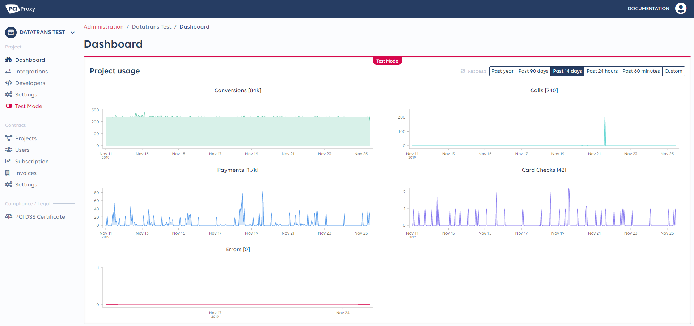

# PCI Proxy Dashboard

The [PCI Proxy dashboard](https://dashboard.pci-proxy.com) enables you to configure and operate your PCI Proxy account by using various features. You can use it to create new projects on your account, add new or existing integrations to projects as well as have an overview about the activity on your account.   
  
In the following sections you can learn more about the dashboard. 

