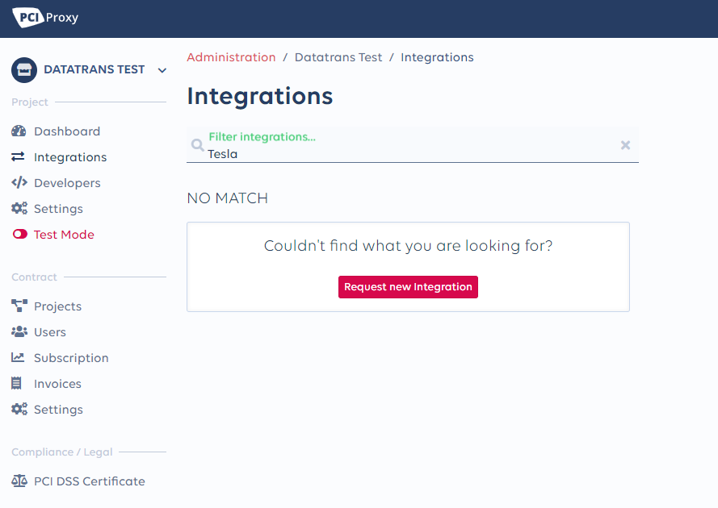

# Add Integrations

Before you can filter payloads from a remote server you have to add the remote server as an integration to your account. PCI Proxy provides you with over 400 preconfigured integrations to partner across all industries. In case you're missing one, add it within minutes by providing us with payload samples and related endpoints. 

#### 1. Add existing integration to your account

1\) Navigate to the Integrations menu on your project and type in the name of the integration  
2\) Check the endpoint of the integrationd and press **Install**  
3\) Check if the payload fits your example and press again **Install** to activate the integration

#### 2. Add a missing integrations to your account

1\) Navigate to the Integrations menu on your project and type in the name of the missing integration  
2\) Press **Request new Integration** button and complete the form  
3\) You get notified once the requested integration is ready to be installed on your Project

