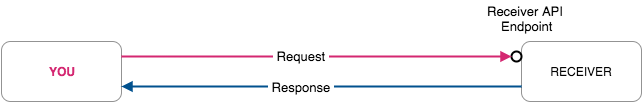

# Request Types

In general, you either **PULL** a request or a partner **PUSH**es data to your server. No matter if sensitive card data are in the request or response. PCI Proxy can extract and populate sensitive data in all operations.

Please see a list of supported channels and their respective channel type: [Supported Channels](supported-channels.md).

Please see a list of supported Receivers \(Gateways\) and their respective Receiver type: [Supported Receivers \(Gateways\)](supported-receivers.md).

## Collect from Channel

Collecting card data from a Channel via web service can work in two ways. In general, you either perform a pull request to receive card data from the Channel or a Channel starts the request with card data. PCI Proxy can populate sensitive data in both.

### PULL Channel

You will use the _Channel PULL Proxy_ when **you start the request and receive card data in the response**.

| PULL Channel Process Flow w/o PCI Proxy | PULL Channel Process Flow w/ PCI Proxy |
| :--- | :--- |
|  |  |
| 1. **You start **_**RQ**_ against Channel API. | 1. **You start**_** RQ**_ against PCIP Endpoint. |
| 2. Channel sends _**RS**_** **_**with card data**_ to You. | 2. PCI Proxy forwards _RQ_ to _Channel API_. |
| _- You receive sensitive card data -&gt; PCI scope. -_ | 3. Channel sends _RS_ _with card data_ to _PCI Proxy_. |
|  | 4. PCI Proxy scans _RS_ and tokenizes card data. |
|  | 5. PCI Proxy forwards _**RS**_** **_**with token**_ to You. |
|  | _**- You are out of PCI scope -**_ |

RQ = Request; RS = Response; PCIP = PCI Proxy API

### PUSH Channel

You will use the _Channel PUSH Proxy_ when **your partner starts the request with card data**.

| PUSH Channel Process Flow w/o PCI Proxy | PUSH Channel Process Flow w/ PCI Proxy |
| :--- | :--- |
|  |  |
| 1. **Channel starts **_**RQ with card data**_ against Your API. | 1. _**Channel starts RQ**_** **_**with card data**_ against PCIP Endpoint. |
| _- You receive sensitive card data -&gt; PCI scope. -_ | 2. PCI Proxy scans _RQ_ and tokenizes card data. |
| 2. You return _RS_ to Channel. | 3. PCI Proxy forwards _**RS with token**_ to Your API. |
|  | _**- You are out of PCI scope -**_ |
|  | 4. You return _RS_ via PCI Proxy to Channel. |

RQ = Request; RS = Response; PCIP = PCI Proxy API

## Forward to Receiver

Forwarding card data to a Receiver via web service can work in two ways. In general, you either perform a pull request to forward card data to a Receiver or a Receiver starts the request to ask for card data. PCI Proxy can populate sensitive data in both.

### PULL Receiver

You will use the _Receiver PULL Proxy_ when **you start the request with card data**.

| PULL Receiver Process Flow w/o PCI Proxy | PULL Receiver Process Flow w/ PCI Proxy |
| :--- | :--- |
|  |  |
| 1. **You start **_**RQ with card data**_ against Receiver API. | 1. **You start**_** RQ with token**_ against PCIP Endpoint. |
| _- You touch sensitive card data -&gt; PCI scope. -_ | _**- You are out of PCI scope -**_ |
| 2. Receiver returns _RS_ to You. | 2. PCI Proxy de-tokenizes and populates_ RQ with card data._ |
|  | 3. PCI Proxy forwards _**RQ with card data**_ to Receiver. |
|  | 4. Receiver returns RS to You. |

RQ = Request; RS = Response; PCIP = PCI Proxy API

### PUSH Receiver

You will use the _Receiver PUSH Proxy_ when **your partner start the request and you return card data in the response**.

| PUSH Receiver Process Flow w/o PCI Proxy | PUSH Receiver Process Flow w/ PCI Proxy |
| :--- | :--- |
|  |  |
| 1. **Receiver starts **_**RQ**_ against Your API. | 1. **Receiver starts **_**RQ**_ against PCIP Endpoint. |
| 2. You return _**RS with card data**_ to Receiver. | 2. PCI Proxy forwards _RQ_ to Your API. |
| _- You touch sensitive card data -&gt; PCI scope. -_ | 3. You return _**RS**_** **_**with token**_** **to PCI Proxy. |
|  | _**- You are out of PCI scope -**_ |
|  | 4. PCI Proxy de-tokenizes and populates _RS with card data_. |
|  | 5. PCI Proxy forwards \_**RS with card data** \_to Receiver. |

RQ = Request; RS = Response; PCIP = PCI Proxy API

