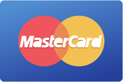
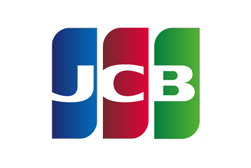

# Test credentials

## Test Credit and Debit Cards

We have a set of test credit card numbers that you can use in our sandbox environment to test your integration. Limit and 3D support is only needed for transactions and not for tokenization.


Productive credit card information cannot be used in the sandbox.


| **Brand**                                                                      | **Code** | **PAN**          | **Token**                        | **Expiry** | **CVV** | **Limit** | **3D** |
| ------------------------------------------------------------------------------ | -------- | ---------------- | -------------------------------- | ---------- | ------- | --------- | ------ |
|            | VIS      | 4242424242424242 | AAABcH0Bq92s3kgAESIAAbGj5NIsAHWC | 06/2025    | 123     | yes       | No     |
|        | VIS      | 4900000000000086 | AAABcH0BrE-s3kgAESIAAWdCRyMPAGvp | 06/2025    | 123     | No        | Yes    |
|        | VIS      | 4900000000000003 | AAABcH0BrFms3kgAESIAAfHfAmyjACIJ | 06/2025    | 123     | No        | Yes    |
|      | ECA      | 5404000000000001 | AAABcH0BrGOs3kgAESIAAc6gFVXTAGTv | 06/2025    | 123     | Yes       | Yes    |
|  | ECA      | 5200000000000007 | AAABcH0BrG2s3kgAESIAAbmn7rNZAC1l | 06/2025    | 123     | No        | No     |
|  | ECA      | 5200000000000080 | AAABcH0BrHes3kgAESIAAYJ5A6WzAFsz | 06/2025    | 123     | No        | Yes    |
|            | AMX      | 375811111111115  | AAABcH0BrICs3kgAESIAAQ33vcLxADJm | 06/2025    | 1234    | Yes       | No     |
|        | AMX      | 375000000000007  | AAABcH0BrIms3kgAESIAAVp8kILAAAka | 06/2025    | 1234    | No        | Yes    |
|        | AMX      | 375811111111123  | AAABcH0BrJ6s3kgAESIAAR0FRZnvADsW | 06/2025    | 1234    | No        | No     |
|          | DIN      | 36168002586009   | AAABcH0BrKis3kgAESIAARz0vKeyAJP1 | 06/2025    | 123     | Yes       | -      |
|      | DIN      | 36167719110012   | AAABcH0BrLKs3kgAESIAAeXMwAnVALLl | 06/2025    | 123     | No        | -      |
|        | DIS      | 6011000000000004 | AAABcH0BrLys3kgAESIAASKNHo0kAGkv | 06/2025    | 123     | -         | -      |
|             | JCB      | 3569990010030442 | AAABcH0BrMas3kgAESIAAQ4E6D72AL1p | 06/2025    | 123     | Yes       | -      |
|         | JCB      | 3569990010030400 | AAABcH0BrM6s3kgAESIAATeCFGr8AHNk | 06/2025    | 123     | No        | No     |
|             | ELO      | 6550000000000001 | AAABcH0BrNes3kgAESIAAZlN82oMAH2p | 06/2025    | 123     | -         | -      |
|         | ELO      | 6362970000457013 | AAABcH0BrOKs3kgAESIAAVLzQBQNADfQ | 06/2025    | 123     | -         | -      |
|           | HCP      | 3841000000000007 | 7LHXscqwAAEAAAGCPojFf2wsu9gTAChQ | 06/2025    | 123     | No        | No     |
|             | CUP      | 6222821234560017 | AAABcH0BrOys3kgAESIAAbnkTiwZAKFg | 06/2025    | -       | No        | Yes    |
|         | CUP      | 6223164991230014 | AAABcH0BrPWs3kgAESIAASDQEWOHACL7 | 06/2025    | -       | No        | No     |
|                                                                                |          |                  |                                  |            |         |           |        |

| **Limit (Amount / amount range)** | **Error message**                                               |
| --------------------------------- | --------------------------------------------------------------- |
| <= 90.--                          | Transaction authorized                                          |
| > 90.-- and <= 100.--             | Transaction declined (i.e. insufficient limit, bad expiry date) |
| > 110.--                          | Card blocked (lost or stolen)                                   |

## Test IBAN, Account Number, and Branch Code&#x20;

Please use the following credentials to test IBAN, Account Number, and Branch Code tokenization:


Productive bank information cannot be used in the sandbox.


| Field            | Number                 |
| ---------------- | ---------------------- |
| `IBAN`           | DE85123456781234512345 |
| `Account Number` | 31510604               |
| `Branch Code`    | 100000                 |

## Test 3D Secure Cards

Use the following test card data to simulate **3D Secure v2** transaction. 3D Secure v1 enabled cards are not supported anymore by the card brands since October 2022 and will therefore lead to a decline when still used.&#x20;


Productive card information cannot be used in the sandbox.


| Brand                                                                                     | Code  | Number           | CVV  | Scenario                           |
| ----------------------------------------------------------------------------------------- | ----- | ---------------- | ---- | ---------------------------------- |
| Mastercard           | `ECA` | 5100001000000022 | 123  | 3D v2 - challenge authenticated    |
| Mastercard           | `ECA` | 5100001000000048 | 123  | 3D v2 - challenge declined         |
| Mastercard           | `ECA` | 5100001000000014 | 123  | 3D v2 - frictionless authenticated |
| Mastercard           | `ECA` | 5100001000000030 | 123  | 3D v2 - frictionless declined      |
| Visa                       | `VIS` | 4000001000000034 | 123  | 3D v2 - frictionless declined      |
| Visa                       | `VIS` | 4000001000000018 | 123  | 3D v2 - frictionless authenticated |
| Visa                       | `VIS` | 4000001000000042 | 123  | 3D v2 - challenge declined         |
| Visa                       | `VIS` | 4000001000000026 | 123  | 3D v2 - challenge authenticated    |
|  American Express | `AMX` | 340000100000024  | 1234 | 3D v2 - challenge authenticated    |
|  American Express | `AMX` | 340000100000040  | 1234 | 3D v2 - challenge declined         |
|  American Express | `AMX` | 340000100000016  | 1234 | 3D v2 - frictionless authenticated |
|  American Express | `AMX` | 340000100000032  | 1234 | 3D v2 - frictionless declined      |
| Diners Club              | `DIN` | 30569309025904   | 123  | 3D v2 - challenge authenticated    |
| Discover               | `DIS` | 6011000000000004 | 123  | 3D v2 - challenge authenticated    |

#### Expiration Date: 

Month: 06 (June)\
Year: 25 (2025)\
Short: 06/25

#### Password for Challenge Flow: 

Use the following passwords to determine the result of a 3D v2 enrolled card.

4444 = authenticated

4009 = declined

## Add Test Cards


[Contact us](mailto:support@pci-proxy.com) if you want to add more test card numbers to your sandbox account.

