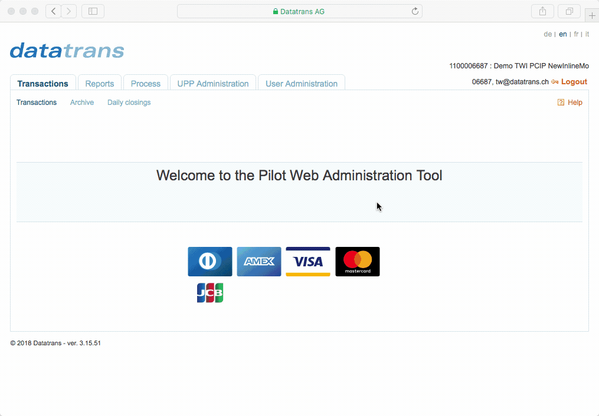

# Setup

After [**sign up**](https://www.pci-proxy.com/pci-proxy/contact/), you can create additional merchant identification to secure your communication. 


You will need this information for different tokenization and detokenization APIs.


## Create Security Sign

The [Filter Proxy](../collect-and-store-cards/filter-payloads.md), [Forward Proxy](../use-stored-cards/forward/https.md) and [Charge API](../use-stored-cards/authorize/) need a static sign. You send it as `X-CC-SIGN` in the http header. When you sign up for the sandbox account, we set the `X-CC-SIGN` for you. You can change it any time in our [Web Administration Tool](https://admin.sandbox.datatrans.com/):

1. Click _UPP Administration_ tab.
2. Click _Security_ sub-tab.
3. Click _Generate new sign._
4. Click _Update_.  

   

## Create Salt Value

The [Show API](../use-stored-cards/show.md) needs a dynamic digital signature. You can generate the sign with a standard HMAC-SHA-256 hash procedure and using a merchant-specific encryption key \(HMAC\). The HMAC key is delivered in hexadecimal format, and it should also be stored in this format. Before its usage the key must be translated into byte format. The HMAC key is generated by the system and can be changed at any time in our [Web Administration Tool](http://pilot.datatrans.biz):

1. Click _UPP Administration_ tab.
2. Click _Security_ sub-tab.
3. Click _Other services_ tab.
4. Click _Generate new "salt"_
5. Click _Update_.

   

## Next up



