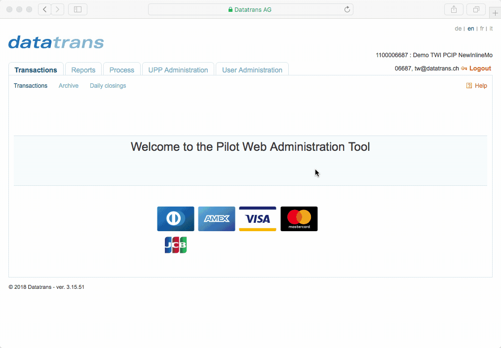
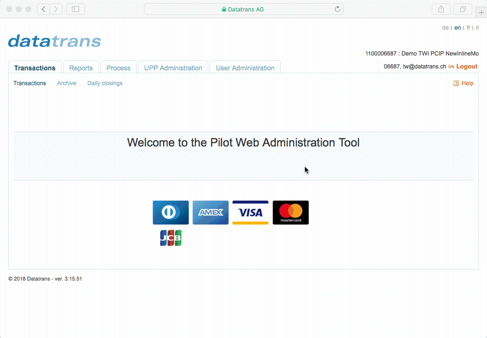

# Step 1 - Setup

Before taking your integration live, use our Sandbox environment to test it thoroughly. The Sandbox environment is a self-contained testing environment, identical to our productive environment.

## 1. Create your Sandbox Account

Follow these steps to create your Sandbox account:

1. [**Sign up**](https://www.pci-proxy.com/pci-proxy/contact/) for a free 30-day trial account \(no billing information required\).
2. After a short internal confirmation, you will receive your preliminary Sandbox credentials.
3. [**Log in**](https://admin.sandbox.datatrans.com/) with your credentials and follow instructions to create your own password.

> Note you receive** two separate merchant IDs** when using [_Website Tokenization_](step-2-tokenize-and-store-cards/website-tokenization/) and [_Filter Payloads_](step-2-tokenize-and-store-cards/filter-payloads.md).

## 2. Setup your Sandbox Account

Create additional merchant identification to secure your communication.   
You will need this information for Step 2 and 3.

### Create Security Sign

1. Click _UPP Administration_ tab.
2. Click _Security_ sub-tab.
3. In the listing of _Transaction security _click the second radio button.  

   

4. Click _Generate new sign._
5. Click _Update_.

### Create Salt Value

1. Click _UPP Administration_ tab.
2. Click _Security_ sub-tab.
3. Click _Other services_ tab.
4. Click _Generate new "salt"_

   

5. Click _Update_.

> ### Great, Step 1 completed!
>
> You have successfully signed up and setup your Sandbox account. Next up, you learn how you securely collect credit card data without ever touching your systems. Please continue to [**Step 2**](step-2-tokenize-and-store-cards/).
>
> #### Questions?
>
> Don't hesitate to talk to us via email, phone, or Slack. We love to help you with the integration or other questions around PCI compliance or the PCI Proxy.
>
> Phone: +41 44 256 81 91  
> Email: [support@pci-proxy.com](mailto:setup@pci-proxy.com)

