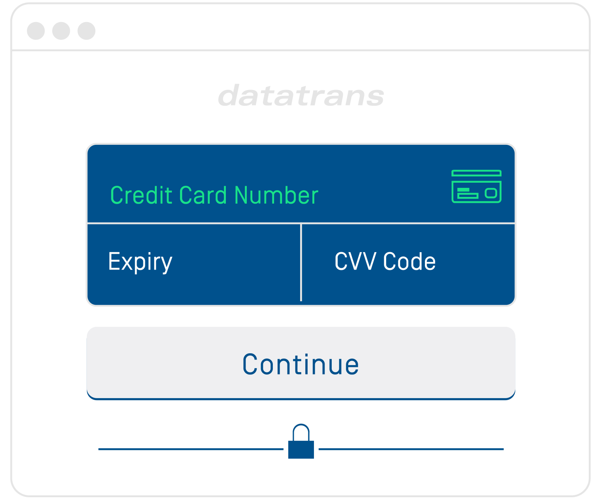
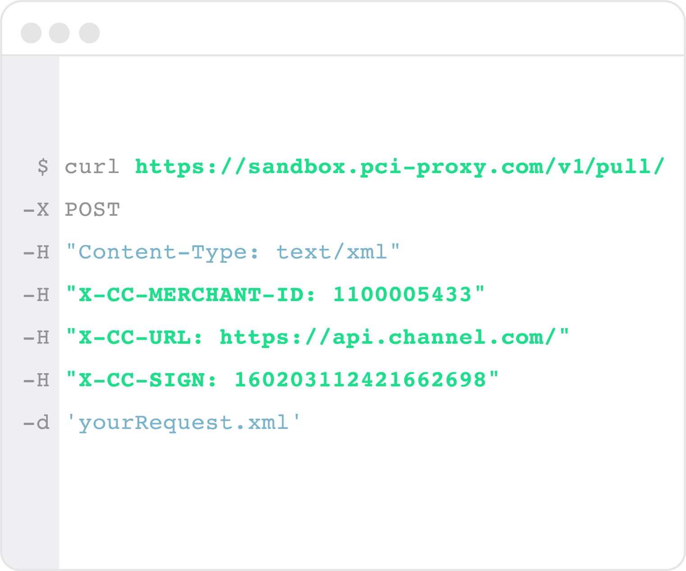
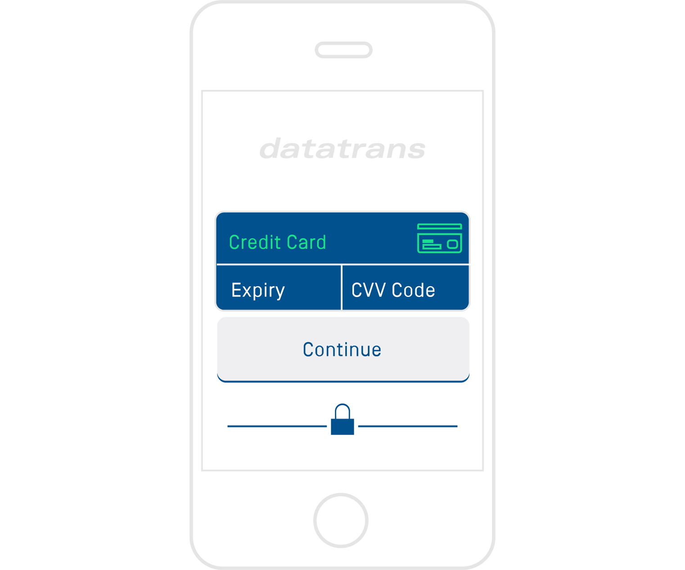

# Collect & store cards

In general, you have different inbound channels where you receive sensitive card data from customers or partners. In order to avoid sensitive card data touching your systems, you pick the relevant source of credit card data and implement the respective PCI Proxy API.

## Choose source of card data and integrate PCI Proxy API

The three main sources of credit card data are:

| [**Website**](website-tokenization/) \(IBE\) | [**Webservice**](filter-payloads.md) \(eg. Booking.com\) | [**Native App**](xml-alias-gateway.md) \(iOS / Android\) |
| :--- | :--- | :--- |
|  |  |  |
| Your customers enter their credit card data on a form within your website. | You receive a request from a remote server including credit card data in the payload. | Your customers enter their credit card data on a form within your native app. |
| [Inline Mode](website-tokenization/) seamlessly tokenizes sensitive data within your web app. | [PUSH & PULL Proxy](filter-payloads.md) tokenizes on the fly sensitive data within your web services. | [XML Alias Gateway](xml-alias-gateway.md) tokenizes sensitive data within your mobile app. |


**With all described methods, sensitive card data never touch your servers**.



**Questions?**

Don't hesitate to talk to us via email, phone, or Slack. We love to help you with the integration or other questions around PCI compliance or the PCI Proxy.

Phone: +41 44 256 81 91  
Email: [support@pci-proxy.com](mailto:support@pci-proxy.com)


