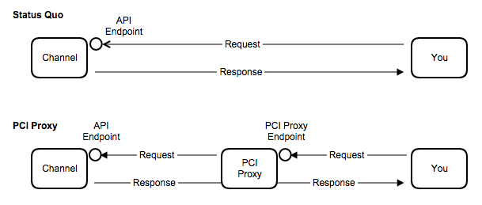
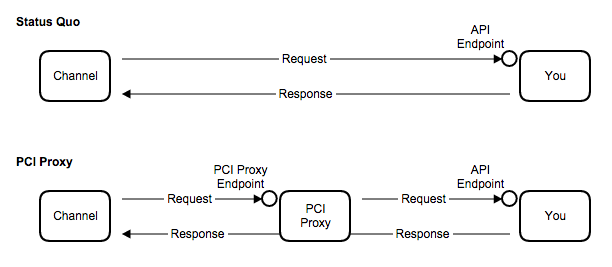

# Collect payment data from XML/SOAP calls

Let us assume you receive or request messages with sensitive data via API from a partner (channel).

`By switching PCI Proxy between you and the channel`, payment data is extracted and automatically stored in our secure vault. A reference number (token) is issued that substitutes the payment data in the request or response. The message structure of the channel API always remains the same. 

*You are allowed to store the token in your system, as it is not PCI DSS relevant.*

The token can be used later on to charge, forward or retrieve payment data. 

**All happens before sensitive payment data ever touch your server to reduce your PCI scope.**


---


> **Failure Security & Response Times**

> *No worries, our redundant server layouts and connections are blazing fast and handle rerouting in no time so that response times are kept at a minimum. [Read More](webseite-security-site)*

> *We also have SLAs ready for you. Please [get in touch](start@pci-proxy.com) for more info.*


## How to start

> [Sign up](signup) for a free developer test account.

In general, you either perform a pull request to receive data or a channel pushes data to your server. PCI Proxy can extract payment data from both.


## Perform a pull request against another API


**Understanding the process flow:**





**Consider a business that needs this ability:**

*You are a travel technology company pulling new reservations from portals such as Booking.com. As reservations may contain payment data, Booking.com asks for your PCI DSS compliance.*

*By using PCI Proxy, Booking.com removes this requirement from you, because we as a company are PCI DSS compliant and you can bank on our full Level 1 PCI DSS compliance.*


### Quick Start Guide:

1. Add a channel to your account
2. Add required HTTP header to your request.
3. POST your XML/SOAP request having PCI Proxy as endpoint.


| **PCI Proxy PULL Endpoint:** |
| -- |
| https://pilot.datatrans.biz/upp/proxy/pull/|

- **Required HTTP header:**


| HTTP header      | Description                                                        | Example value
| -------------- | -------------------------------------------------------------------| ---
| `X-CC-URL` | Specifies the target (3rd party) URL that will be called | https://api.channel.com/
| `X-CC-MERCHANT-ID` | Your merchant ID | 1000011011
| `X-CC-SIGN` | Configured security sign | 130709090849785405
            

- **Example POST:**

```java
    $ curl "https://pilot.datatrans.biz/upp/proxy/pull" 
        -X POST 
        -H "Content-Type: text/xml" 
        -H "X-CC-MERCHANT-ID: 1100005433" 
        -H "X-CC-URL: https://api.channel.com/" 
        -H "X-CC-SIGN: 160203112421662698" 
        -d 'yourRequest.xml'
```

> Note: In test mode, only test credit cards are allowed. For testing purposes, you will need our [test credit cards](https://www.datatrans.ch/showcase/test-cc-numbers). Learn more about [live mode and testing](live_mode-test.html).
    
## Receive a request from a channel


**Understanding the process flow:**



**Consider a business that needs this ability:**

*You are a travel technology company receiving new reservations from booking portals on an API endpoint at your server. As reservations may contain sensitive payment data, your servers are in PCI scope.*

*With the use of PCI Proxy, payment data never touch your server and, hence, you reduce your PCI scope.* 

### Quick Start Guide

To switch PCI Proxy between you and a channel that pushes data, you just add a new channel. The channel can use it and invoke requests having PCI Proxy as endpoint.

1. Add a push channel to receive `{YOUR-SPECIFIC-KEY}`.
2. Exchange API endpoint with PCI Proxy PUSH endpoint at your partner.

| **Test PCI Proxy PUSH Endpoint:** |
| -- |
| https://pilot.datatrans.biz/upp/proxy/push/ `{YOUR-SPECIFIC-KEY}`  |

> Note: In test mode, only test credit cards are allowed. For testing purposes, you will need our [test credit cards](https://www.datatrans.ch/showcase/test-cc-numbers). Learn more about [live mode and testing](live_mode-test.html).


## Add a channel

Adding a new channel is easy. Please send the following information to [setup@pci-proxy.com](mailto:setup@pci-proxy.com). 

|Information| Description   |
|---|---|
|Channel Type|Define if it is a push or pull channel.|
|API endpoint|The URL where we should forward the request to.|
|Sample Request & Response|Please include API name, required headers, auth fields, and request method.|

You will receive a confirmation once the channel is successfully added. For push channels, you also receive `{YOUR-SPECIFIC-KEY}`.

#### Supported channels

We support a variety of channel APIs out of the box. Every day, more and more channels get added.

#### VPN and Leased Lines

In case the channel transmits your data over VPN or Leased Line, we can add secure connections to adapt to your needs. Please [get in touch](start@pci-proxy.com) for more info.


