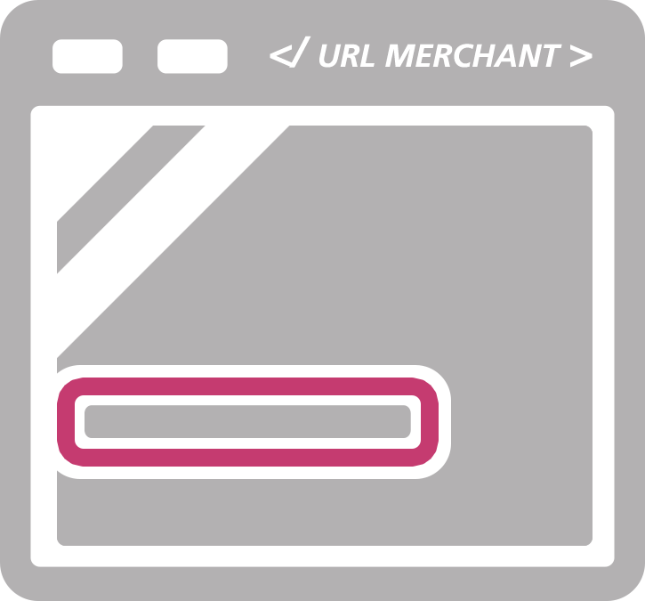

# Quickstart: Collect card data from website or application

`PCI Proxy gives you several options on how to collect payment data from a HTML web form` and securely store it in our vault. A reference number \(token\) is issued and sent to your systems.

**All options assure your servers never get in touch with sensitive card data to reduce your PCI scope to the least.**

---

## 1. Pick integration option

With the following 4 options, you can collect sensitive card data and reduce your PCI scope to the least, qualifying for the [SAQ A](understand_pci_dss.html).

| Redirect Mode | Lightbox Mode | Inline Mode | Tokenizer iFrame |
| :---: | :---: | :---: | :---: |
|  |  |  |  |
| Redirect consumer to payment page managed by Datatrans. | Payment pages are placed on shop as overlay \(iFrame\). | Payment page managed by Datatrans is incorporated with iFrame. | Single form field for instant tokenization with callbacks embedded as iFrame |

* The easiest way to start is by integrating our Payment Page `Redirect Mode` or `Lightbox Mode`. It takes care of building a conversion-optimized HTML form and validating input fields. 

* If you need a more custom approach, try our Payment Page `Inline Mode`. The Inline Mode allows you to integrate the payment form into your website with an iframe. With this approach you can adjust the style of the payment form by applying your custom CSS. 

* The `Tokenizer iFrame` can be used if you only need to tokenize sensitive card data.

_We offer even more sophisticated options to seamlessly collect payment data. With our Ajax API and Hidden Mode, you can create and design your own payment data collection forms. Please bear in mind that Ajax and Hidden-Mode solutions increase your PCI scope to SAQ A-EP. _[_Learn More._](https://www.datatrans.ch/en/technics/payment-apis/hidden-ajax-mode)

---

#### 2a. Embedding Payment Page \(Redirect, Lightbox or Inline\) in your site

To get started with the Payment Page `Redirect Mode` , add the following simple HTML a tag to your page:

```java
<a href="https://pilot.datatrans.biz/upp/jsp/upStart.jsp
            ?merchantId=1100004624
            &refno=pci-proxy-redirect
            &amount=1
            &currency=CHF
            &theme=DT2015
            &uppAliasOnly=yes">Collect card data</a>
```

To get started with the Payment Page `Lightbox Mode`, you can use the following code snippet:

```java
<script src="https://code.jquery.com/jquery-1.11.2.min.js"></script>
    <script src="https://pilot.datatrans.biz/upp/payment/js/datatrans-1.0.2.js"></script>

    <form id="paymentForm"
        data-merchant-id="1100004624"
        data-refno="pci-proxy-lightbox"
        data-amount="1"
        data-currency="CHF"
        data-upp-alias-only="yes"
        data-sign="30916165706580013">

    <button id="paymentButton">Pay</button>

    </form>

    <script type="text/javascript">
        $("#paymentButton").click(function () {
            Datatrans.startPayment({'form': '#paymentForm'});
        });
    </script>
```

To integrate the Payment Page `Inline Mode` you have to use an iframe:

```java
<iframe width="600" height="500" frameborder="0" border="0" src="https://pilot.datatrans.biz/upp/jsp/upStart.jsp
            ?merchantId=1100004547
            &refno=pci-proxy-inline
            &amount=1
            &currency=CHF
            &uppAliasOnly=yes
            &theme=Inline
            &paymentmethod=VIS
            &customTheme=mytheme">
```

_Note: In test mode, only test credit cards are allowed!_

> #### Good Job!
>
> You just captured credit card data on your website without sensitive data touching your servers.

#### Reference

| Mandatory Parameter | Description | Example value |
| --- | --- | --- |
| `merchantId / data-merchant-id` | Your merchant ID | 1000011011 |
| `refno / data-refno` | You can set a \(unique\) reference number for identification | yourreference |
| `amount / data-amount` | Use `1` to tokenize or enter transaction amount in smallest unit of currency to transact | 1000 |
| `currency / data-currency` | transaction currency – ISO Character Code - ignored for tokenization | EUR |
| `sign / data-sign` | Configured security sign1 \(can be set in Web Admin Tool\) | 130709090849785405 |
| `uppAliasOnly / data-upp-alias-only` | Mandatory to tokenize the credit card | yes |

-

| Additional Parameter | Description | Example value |
| --- | --- | --- |
| `theme` | evokes payment page in Inline Mode | Inline |
| `paymentMethod` | defines payment method \(see list above\) | VIS |
| `customTheme` | Name of a CSS class selector specified in a custom CSS file\* which you submit to Datatrans. | mytheme |

---

#### Integrate Tokenizer iFrame

If you only want to collect the credit card number on the fly, please use our `Tokenizer iFrame`. The sensitive card number field is embedded with an iframe into your order or payment page. You can instantly receive the token while your customer is in checkout by listening to the event handler. This gives you great flexibility when designing a custom order process.

| Parameter | Description | Example value |
| --- | --- | --- |
| `merchantId` | Your merchant ID | 1000011011 |
| `customTheme` | Name of a CSS class selector specified in a custom CSS file\* which you submit to Datatrans. | mytheme |

_\*The following example matches _`mytheme`_ with: _`.mytheme input { border: 1px solid red; }`

To integrate the `Tokenizer iFrame` you can use the following code snippet:

```java
<form id="payment-form">
  <label for="cardholder">Cardholder</label>
  <input type="text" id="cardholder" name="cardholder"/>

  <!-- This is where the CC number input field will appear -->
    <div id="cc-wrapper">
      <div style="display: table-cell; vertical-align: middle;">
        <label for="tokenizer">Cardno</label> 
      </div>
      <div style="display: table-cell; vertical-align: middle;"> 
        <iframe id="tokenizer"
                frameborder="0"
                height="40"
                scrolling="no"
                src="https://pilot.datatrans.biz/upp/payment/tokenize?
                    merchantId=1000011011
                    &customTheme=mytheme">
        </iframe> 
      </div>
    </div>
  <!-- Expiry Month and Year are not PCI-sensitive data-->
  <label for="month">Expiry Date</label> 
    <input name="month" type="text" size="4"> / 
    <input name="year" type="text" size="4"> 
    <br/><br/>
    <input type="submit" disabled/> 
</form>
```

##### Listening to events

Add an event listener to your parent frame in order to receive the corresponding events once a tokenization was successful or resulted in an error:

```javascript
if (window.addEventListener) { 
    window.addEventListener('message', windowEventHandler);
  } else if (window.attachEvent) {
    window.attachEvent('message', windowEventHandler); 
  }
```

```javascript
function windowEventHandler(event) {
  // Make sure to check for event.origin here 
  if(event.data !== undefined) {
    var status = event.data.type;
    var result = event.data.result; 
  }
}
```

An event is getting posted to the parent frame when the card number input field loses focus \(onblur\).

In case of a successful tokenization the data object of the event passed to the windowEventHandler contains the following data:

```java
{
  "type":"success", 
  "result":
    {
    "aliasCC":"70119122433810042", 
    "maskedCC": "424242xxxxxx4242", 
    "paymentmethod":"visa"
    } 
}
```

If a wrong card number is detected or the the luhn check didn’t pass the data object looks like:

```java
{ 
  "type":"error",
  "result":"not valid credit card" 
}
```

##### Tested Browsers

| Desktop | Mobile |
| --- | --- |
| &gt;=IE10 | iOS Safari &gt;= 6 |
| &gt;=Firefox 30 | Android &gt;=4 |
|  | &gt;=Chrome 32 |
|  | &gt;=Safari 6 |

[http://caniuse.com/\#search=postMessage](http://caniuse.com/#search=postMessage)

##### Customizing the iframe

Additionally, the iframe sends the `ready` event to signal that the iframe is ready:

```java
{
    "type":"ready"
}
```

This event allows you to customize the iframe.

Currently it's possible to change the `placeholder` attribute of the card number input field.

```js
function windowEventHandler( event ) {
        // react to 'ready' event
        if ( event.data.type === 'ready' ) {
            // post a message back to the iframe to request the attribute change
            event.source.postMessage( {
                type: 'customize',
                selector: '#cardNumber',
                attributes: { 'placeholder': 'Custom placeholder' }
            }, "*" );
        }
    }
```


