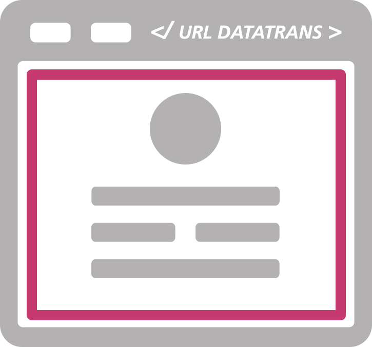
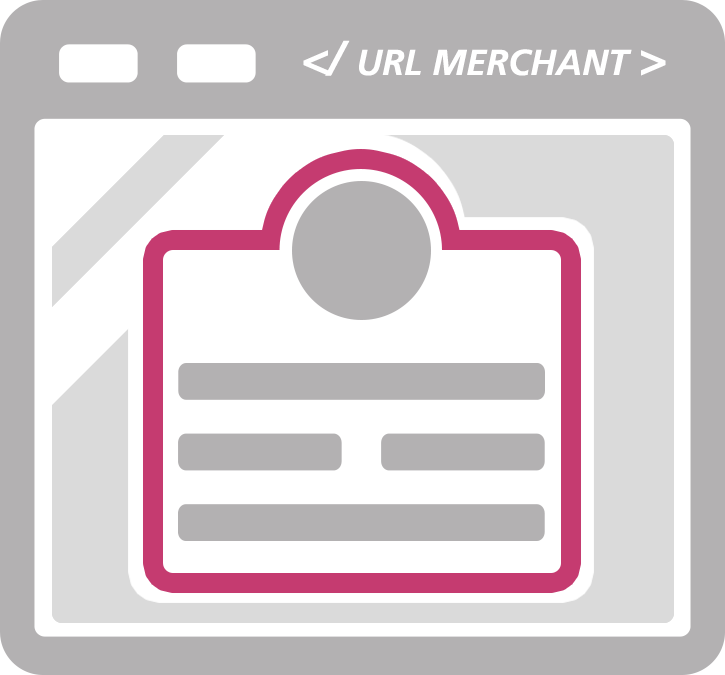
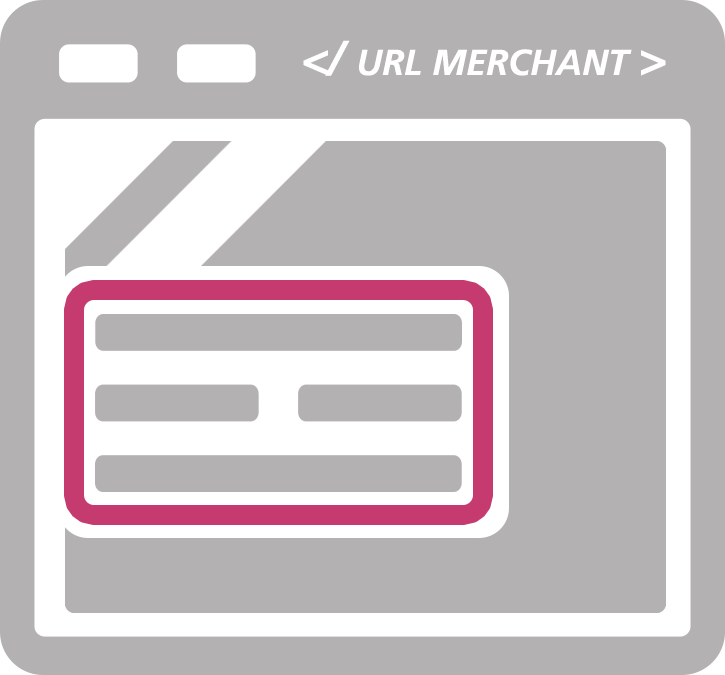

# Collect payment data from website or application

Let us assume you run a website or application where customers or agents entering payment data into a HTML web form. 

`PCI Proxy gives you several options on how to collect payment data from a HTML web form` and securely store it in our vault. A reference number (token) is issued and sent to your systems. 

*You are allowed to store the token in your system, as it is not PCI DSS relevant.*

The token can be used later on to charge, forward or retrieve payment data. 

*Add-on: All following options have a built-in feature to instantly charge payment data. *

**All options assure your servers never get in touch with sensitive card data to reduce your PCI scope to the least.**

## Overview

With the following 3 options, you can collect payment data and reduce your PCI scope to the least, qualifying for the [SAQ A](understand_pci_dss.html).

Redirect Mode| Lightbox Mode        | Inline Mode 
:------------:|:--------------------:|:-----------:
 |  |     
Redirect of consumer to payment page managed by Datatrans. | Payment pages are placed on shop as overlay (iFrame). | Payment page managed by Datatrans is incorporated with iFrame.    
[Demo + Code Sample](https://www.datatrans.ch/showcase/authorisation/redirect-mode) | [Demo + Code Sample](https://www.datatrans.ch/showcase/authorisation/lightbox-mode) | [Demo + Code Sample](https://www.datatrans.ch/showcase/authorisation/inline-mode)

We offer more sophisticated options to seamlessly collect payment data. With our Ajax API and Hidden Mode, you can create and design your own payment data collection forms. [Learn More.](ajax-hidden)

## How to start

> [Sign up](https://www.datatrans.ch/en/technics/test-account) for a free developer test account.

An easy way to start is by integrating our Redirect or Lightbox Payment Page. It takes care of building a conversion-optimised HTML form and validating input fields. 

#### Integrate Redirect Mode

To integrate the `Redirect Mode` you can use a simple HTML a tag:

```HTML
    <a href="https://pilot.datatrans.biz/upp/jsp/upStart.jsp
    		?merchantId=1100004624
    		&refno=pci-proxy-redirect
    		&amount=1
    		&currency=CHF
    		&theme=DT2015
            &uppAliasOnly=yes">Collect payment data</a>
    ```

#### Integrate Lightbox Mode

To integrate the `Lightbox Mode` you can use the following code snippet:    

```HTML
    <script src="https://code.jquery.com/jquery-1.11.2.min.js"></script>
    <script src="https://pilot.datatrans.biz/upp/payment/js/datatrans-1.0.2.js"></script>
    
    <form id="paymentForm"
        data-merchant-id="1100004624"
        data-refno="pci-proxy-lightbox"
        data-amount="1"
        data-currency="CHF"
        data-use-alias="true"
        data-upp-alias-only="yes"
        data-sign="30916165706580013">
        
    <button id="paymentButton">Pay</button>
    
    </form>

    <script type="text/javascript">
        $("#paymentButton").click(function () {
            Datatrans.startPayment({'form': '#paymentForm'});
        });
    </script>            
    ```


---


#### Integrate Inline Mode

If you need a more customizable approach, you can try our Inline Mode. The Inline Mode allows you to integrate the payment form into your website with an iframe. With this approach you can adjust the style of the payment form by applying your custom CSS.

To integrate the `Inline Mode` you have to use an iframe:

```HTML
<iframe width="600" 
	    height="500"
	    frameborder="0"
	    border="0"
	    src="https://pilot.datatrans.biz/upp/jsp/upStart.jsp
		    ?merchantId=1100004547
		    &refno=pci-proxy-inline
		    &amount=1
		    &currency=CHF
		    &uppAliasOnly=yes
		    &theme=Inline
		    &paymentmethod=VIS
		    &customTheme=mytheme">
    ```


